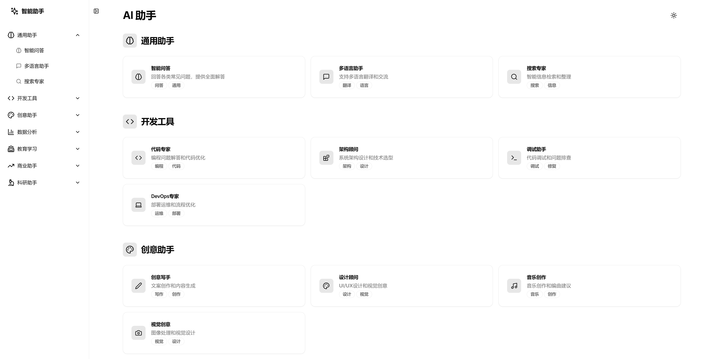

# AI Chat Platform

[English](./README.md) | [中文](./README_CN.md)

AI Chat Platform is a modern AI chat platform built with Next.js, offering multiple AI assistants across various professional domains. The platform features a clean and intuitive interface design, supports multiple themes, and provides a smooth conversation experience.



## Deploy on Vercel

[](https://vercel.com/new/clone?repository-url=https%3A%2F%2Fgithub.com%2Flemoabc%2Fai_card)

## Features

- **Diverse AI Assistants**: Multiple AI assistants across various domains, including general, development, creative, and more
- **Clean User Interface**: Inspired by Apple and Google design principles, emphasizing simplicity and usability
- **Local Storage**: Chat history saved locally for privacy protection
- **Theme Switching**: Support for light/dark themes with system preference sync
- **Responsive Design**: Perfect adaptation for various screen sizes
- **Tag System**: Quickly find the right assistant through tags
- **Animation Effects**: Integrated elegant celebration animations

## Prerequisites

- Node.js 14.0 or higher
- npm or yarn package manager
- Modern browsers (Chrome, Firefox, Safari latest versions recommended)

## Installation

1. Clone the repository:
   ```bash
   git clone https://github.com/Lemo/ai_card.git
   cd ai_card
   ```

2. Install dependencies:
   ```bash
   npm install
   # or
   yarn install
   ```

3. Run the development server:
   ```bash
   npm run dev
   # or
   yarn dev
   ```

Visit `http://localhost:3000` to see the running application.

## Project Structure 
```
project/
├── app/ # Next.js app directory
├── components/ # Components directory
│ ├── chat/ # Chat-related components
│ ├── effects/ # Effect components
│ └── ui/ # Base UI components
├── styles/ # Style files
└── lib/ # Utility functions
```
## Usage Guide

- Home page displays all available AI assistant categories
- Click any assistant card to start a conversation
- Quick switch between assistants via sidebar
- Locally saves the last 50 messages
- Clear conversation history anytime

## Upcoming Features

- Message search functionality
- Conversation export
- Message tagging system
- Keyboard shortcuts
- Mobile optimization
- Custom assistant configuration

## Contributing

We welcome all forms of contributions, whether they're new features, bug fixes, or documentation improvements. Please submit issues or pull requests.

## License

This project is open-source under the MIT license. See the [LICENSE](LICENSE) file for details.

## Tech Stack

This project uses the following open-source technologies:
- [Next.js 14.1.0](https://nextjs.org/)
- [React 18.2.0](https://reactjs.org/)
- [Tailwind CSS](https://tailwindcss.com/)
- [shadcn/ui](https://ui.shadcn.com/)
- [Lucide Icons](https://lucide.dev/)
- [Canvas Confetti](https://www.kirilv.com/canvas-confetti/)

We are grateful to the developers and maintainers of these excellent projects.