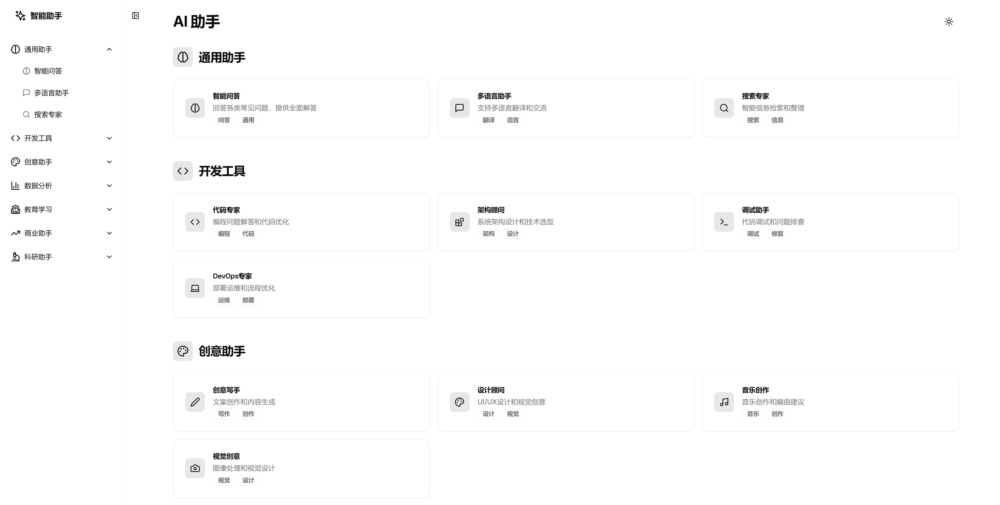

# AI 聊天平台

[English](./README.md) | [中文](./README_CN.md)

AI Chat Platform 是一个基于 Next.js 构建的现代化 AI 聊天平台，提供多个专业领域的 AI 助手服务。平台采用简洁直观的界面设计，支持多种主题，并提供流畅的对话体验。



## 在 Vercel 上部署

[](https://vercel.com/new/clone?repository-url=https%3A%2F%2Fgithub.com%2Flemoabc%2Fai_card)

## 特性

- **多样化的 AI 助手**：提供多个专业领域的 AI 助手，包括通用助手、开发助手、创意助手等
- **简洁的用户界面**：借鉴 Apple 和 Google 的设计理念，强调简洁性和可用性
- **本地存储**：聊天记录保存在本地，保护用户隐私
- **主题切换**：支持浅色/深色主题，可跟随系统设置自动切换
- **响应式设计**：完美适配各种设备屏幕
- **标签系统**：通过标签快速找到所需助手
- **动画效果**：集成精美的庆祝动画效果

## 环境要求

- Node.js 14.0 或更高版本
- npm 或 yarn 包管理器
- 现代浏览器（推荐 Chrome、Firefox、Safari 最新版本）

## 安装步骤

1. 克隆仓库：
   ```bash
   git clone https://github.com/Lemo/ai_card.git
   cd ai_card
   ```

2. 安装依赖：
   ```bash
   npm install
   # 或
   yarn install
   ```

3. 运行开发服务器：
   ```bash
   npm run dev
   # 或
   yarn dev
   ```

访问 `http://localhost:3000` 查看运行效果。

## 项目结构
```
project/
├── app/ # Next.js 应用主目录
├── components/ # 组件目录
│ ├── chat/ # 聊天相关组件
│ ├── effects/ # 特效组件
│ └── ui/ # 基础UI组件
├── styles/ # 样式文件
└── lib/ # 工具函数
```
## 使用说明

- 首页展示所有可用的 AI 助手分类
- 点击任意助手卡片开始对话
- 通过侧边栏快速切换不同助手
- 支持本地保存最近 50 条消息记录
- 可随时清空对话历史

## 即将推出的功能

- 消息搜索功能
- 对话导出功能
- 消息标记系统
- 快捷键支持
- 移动端优化
- 自定义助手配置

## 贡献指南

我们欢迎所有形式的贡献，无论是新功能、bug 修复还是文档改进。请提交 issue 或 pull request。

## 开源协议

本项目采用 MIT 协议开源，详见 [LICENSE](LICENSE) 文件。

## 技术栈

本项目使用了以下开源技术：
- [Next.js 14.1.0](https://nextjs.org/)
- [React 18.2.0](https://reactjs.org/)
- [Tailwind CSS](https://tailwindcss.com/)
- [shadcn/ui](https://ui.shadcn.com/)
- [Lucide Icons](https://lucide.dev/)
- [Canvas Confetti](https://www.kirilv.com/canvas-confetti/)

感谢这些优秀项目的开发者和维护者。